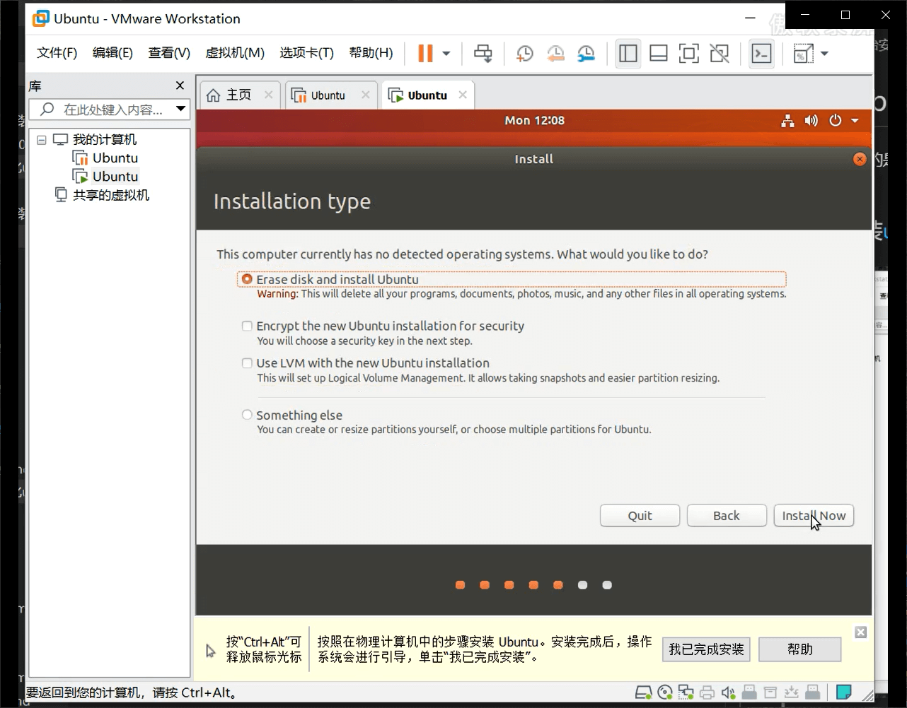
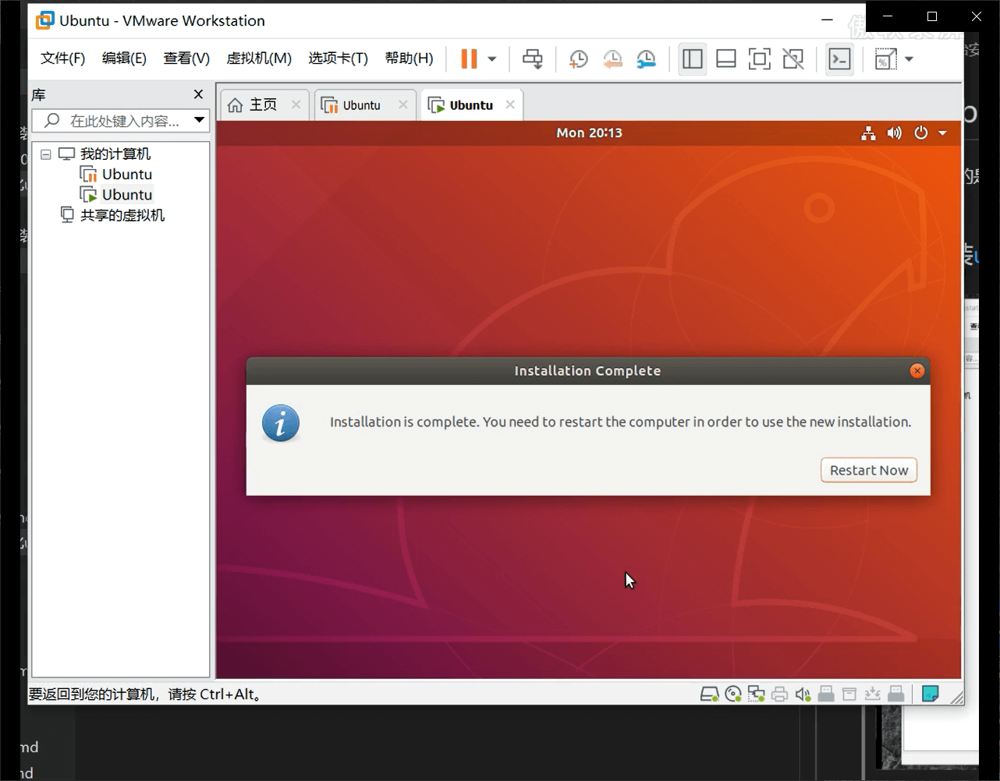
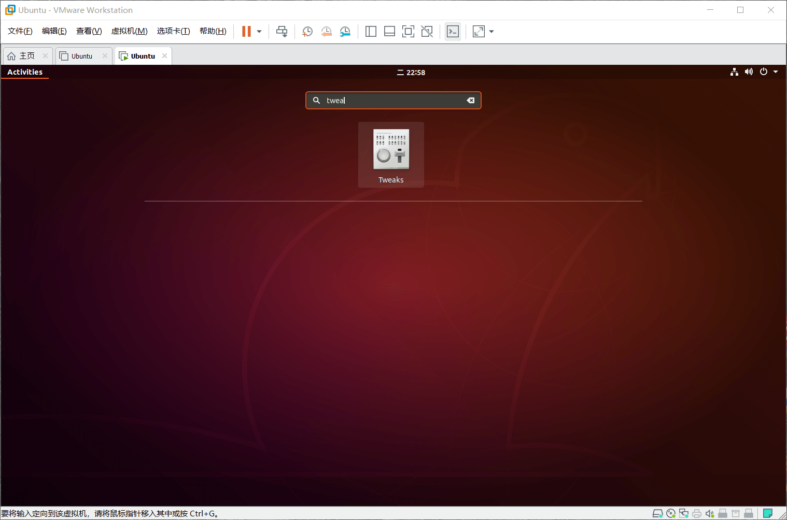
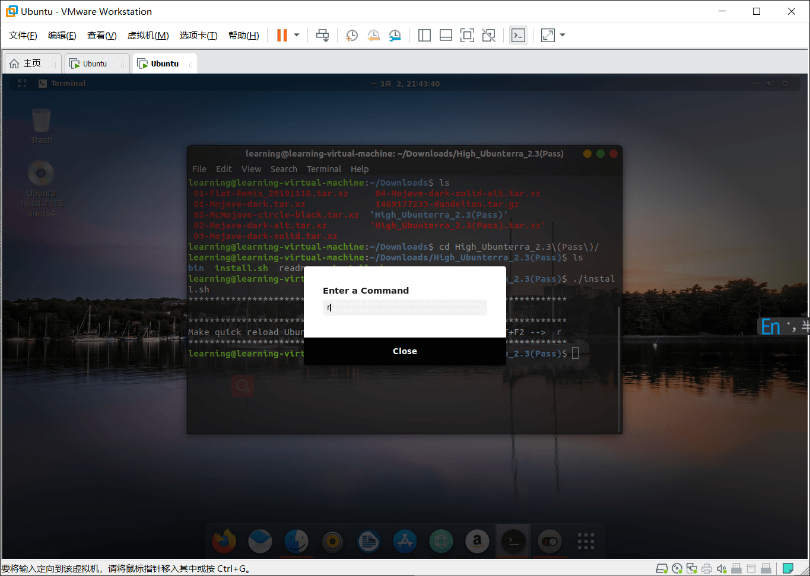

# 安装ubuntu
这里我采用的是VMwarePro15虚拟机，实体机上也是一样的步骤，只不过要自己制作启动盘。(本教程写给linux小白看的，当然我自己也比小白好不了多少，其中难免有不当之处，还望告知[也将此篇文章当做自己的一个学习笔记，不定时更新])

说明一下为啥选择ubuntu，以前刚开始学习使用linux的时候要安装软件通常都不知道名字叫啥，知道命令是apt install xxxxx，就是不知道后面该加什么东西，后面发现ubuntu的提示实在太感人,比如我要使用ifconfig它会提示我安装net-tools，也许其他系统也有只是我没发现，没错！！就因为这个慢慢的爱上ubuntu。233
## 开始安装[ubuntu18.04](https://ubuntu.com/download/desktop "ubuntu官网")

### step1

选择稍后安装操作系统

选择linux ubuntu

选择自己的安装位置

在指定磁盘容量的时候如果打算长期使用的话建议磁盘稍微大一点

点击编辑此虚拟机

从CD/DVD中添加自己下载的系统

开启此虚拟机

### step2

install ubuntu`在这一步你们可以选择chinese`，设置系统语言，也可以安装之后再改

一路continue下去就好了

**在这一步的时候把Download updates while installing ubuntu那一选项去掉**

选择时区

设置用户名和密码`这里设置的密码务必记住，待会儿登录大的时候要用`

开始安装

发现是不是安装的好慢？`告诉你们一个小秘密，其实这里是可以点击skip的`安装的过程好像会联网下载什么东西还是啥的我也不是很清楚，如果不放心的话可以断开网络安装

点击重启

输入刚刚设置的密码就可以登录了


## ubuntu 美化

首先先来确定一下主要美化哪几个方面:
- 壁纸(桌面壁纸、锁屏壁纸)
- 图标(就是你在桌面上看到的那些图标)
- 主题(什么是主题？这个我也不好说)
- 终端terminal(一个漂亮的ubuntu怎么能少了一个漂亮的终端)
- shell(修改了之后最直观的就是顶部的菜单栏改变了)
- 开机动画
- 任务栏

说明一下美化的话需要我们安装插件，你可以通过浏览器来安装插件(前提示已经安装了​chrome-gnome-shell插件)也可以通过命令行来安装(但是有些插件的安装命令我也不知道咋输)，所以安装插件我一般通过浏览器来安装
### step0：安装​chrome-gnome-shell
```bash
sudo apt install chrome-gnome-shell
```

安装好了之后再浏览器输入https://extensions.gnome.org/  打开之后会有一个警告，点击Click here to install browser extension 安装浏览器拓展，按照提示安装，下载完后点击 Add 即可。

安装完了之后我们可以通过浏览器来管理我们安装的插件(这个时候你可以看到右上角有一个黑色的脚丫子图标,以后直接点击该图标就可以进入“主页”)

我这里安装的插件有些多，这是因为我之前安装gnome-shell-extensions软件包，里面包含了许多插件，你们可以通过apt install gnome-shell-extensions 安装，也可以后面用到啥插件的时候用浏览器安装
### step1：安装tweak tool（美化软件，在这里你可以设置壁纸、图标、主题...）、
```bash
sudo apt install gnome-tweak-tool
```

### step2：下载主题、图标等等
简单的说明一下：在官网下载了相应的文件之后，将其解压到相应的位置然后就可以通过tweak这个工具来修改了
```
themes      --> /usr/share/themes
shell       --> /usr/share/themes
icon        --> /usr/share/icons
开机动画    --> /usr/share/plymouth/themes
```

[官网](https://www.gnome-look.org)

我这里直接给出几个链接

[主题](https://www.gnome-look.org/p/1275087/)

[图标](https://www.opendesktop.org/p/1305429/)

[shell](https://www.gnome-look.org/s/Gnome/p/1013030/)

[登录界面](https://www.gnome-look.org/s/Gnome/p/1207015/) 下载的时候注意自己的系统版本，别下错了

[开机动画](https://www.gnome-look.org/s/Gnome/p/1009736/) 我承认我放弃了，可能是虚拟机的原因(修改了也没起作用)

### step3：前面准备工作已经做完了，下面开始正式修改
ok，前面已经下载了需要的文件，可以开始修改了，除了开机动画之外其他的很简单，把下载的文件解压后发到对应的目录下，打开tweaks就可以修改了

下载主题的时候我多下载了几个主题，图中我标出了shell和icon其他的都是主题

下面分别把文件解压之后移动到对应的目录下
```bash
# 解压命令
tar xf 你下载的文件

# 将解压的文件移动到对应的目录，shell和主题都是移动到usr/share/themes/ 目录下，icon移动到/usr/shar/icons/
mv 目标文件 目的地
```

做好这些之后可以先右键选张好看的背景(通过前面的类比你可以发现/usr/share/backgrounds里面存放的就是壁纸)

打开tweak修改成我们下载的文件

修改之后

将任务栏发到下边居中

有的人喜欢透明的terminal


### step4：修改登录界面

将下载的gdm themes文件解压之后进入运行install脚本即可

按照提示alt+f2应用我们所做的修改

查看一下效果

`??这个背景怎么不太对？`下面将记录我解决这一问题的思路；通常我认为授人以鱼不如授人以渔，以前刚入门linux的时候遇到的问题就网上搜索解决方案，但网络上通常直接给出几条命令，至于为什么是这样修改的就不知道了；现在慢慢的熟悉了linux之后也渐渐的懂得了如何查找问题所在。

现在使用vim查看一线我们使用的安装脚本，就是那个install脚本
```bash
vim install.sh
```
第一行我们可以看到它将文件下的一个.css文件复制到了/usr/share/gnome-shell/theme/ubuntu.css
之前查找如何修改锁屏壁纸的时候总是需要去修改/etc/alternatives/gdm3.css的文件，其实这个文件就是连接到/usr/share/gnome-shell/theme/ubuntu.css的。就相当于是windows下的快捷方式一样

那么现在思路就清晰了，安装脚本替换了我们电脑上原本的按个.css样式文件，但是现在锁屏壁纸异常，那么我们查看gdm3.css文件下有关锁屏壁纸的那一部分就可以找到答案了，找到lockDialogGroup，可以看到background是一个url的本地链接，用文件打开到相应的目录并没有发现一个叫gdmlock.jpg的图片，那么现在应该清楚为什么显示异常了

修改一个自己喜欢的背景

问题解决

### step5：安装zsh美化终端
[参考链接1](https://blog.csdn.net/sinat_38804294/article/details/90262473)

[参考链接2](https://ywnz.com/linuxmh/3190.html)

啥时候有空再自己写一个吧

### step6：开机动画

**经供参考，我自己也没成功233**

虽然没有成功，单也做一个自己的学习记录吧，不知道是不是虚拟机的问题(如果哪位老哥虚拟机下能够修改成功还望能够分享一下)

将下载的plymouth theme解压到/usr/share/plymouth/themes目录下

执行命令
```bash
sudo update-alternatives --install /usr/share/plymouth/themes/default.plymouth 
default.plymouth /usr/share/plymouth/themes/"path/to-your-plymouth.plymouth" 100

sudo update-initramfs -u #应用修改

# 也可以
sudo update-alternatives --config default.plymouth 
```
其实主要修改的是

但是我修改之后发现没有ScriptFile字段*可能这就是原因*(但是我下载的文件里本就没有.script文件...后面再查一下资料吧)


## 常见问题解决
### 解决虚拟机窗口大小无法改变(安装VMware tools)

点击虚拟机->安装VMware tools

此时桌面上出现了一个DVD光盘的图标，然后我们右键->Open terminal 打开命令行(`当你习惯命令行之后会发现命令行使用起来是如此的自然、简介、唯美`)

emm...这里看起来好像不是很清楚，我把我的命令列举并说明一下吧
```bash
lsblk #这个命令我就不说了 我一般拿来查看有哪些挂载点的 一般都会在/media目录下 其他的对于新手来说先不用管(其实我也不是很清楚)
cd /media/learning/VMware\ Tools/ #进入这个指定的目录  这个地方learning应该是你自己的用户名 tips:按tab键会自动补全
ls  #查看当前目录下有哪些东西 看到红色的那个压缩包了没，那就是我们需要的东西了
mv VMwareTools-10.3.10-13959562.tar.gz ~ #将压缩包移动到我们账户的主目录下
cd ~ #进入我们的主目录
ls  #查看当前目录下有哪些东西
tar -xf VMwareTools-10.3.10-13959562.tar.gz #将压缩包解压

cd vmware-tools-distrib/ #进入解压之后的文件
ls  #查看当前目录下有哪些东西
sudo vmware-install.pl # 执行安装脚本开始安装 这个时候需要你输入密码(输入的密码是不可见的，你的键盘没坏)


#下面是不带注释的版本
lsblk
cd /media/learning/VMware\ Tools/
ls
mv VMwareTools-10.3.10-13959562.tar.gz ~
cd ~
ls
tar -xf VMwareTools-10.3.10-13959562.tar.gz
cd vmware-tools-distrib/
sudo vmware-install.pl 
```

开始安装之后一路回车下去就ok了(全选默认)

然后就可以看到窗口完美的匹配上了


### 解决安装软件慢的问题(所谓的linux安装之后必做的事之一--换源)
大概说一下吧换源是个怎么回事吧(个人理解)：我们使用windows安装软件的时候都会去网上找资源然后下载，然而在linux里面当你使用命令行(当然你也可以像使用windows一样去网上找\[有一些是不得不这么做])apt install 等命令安装东西的时候(你可以以为apt就是windows下的软件管家，\[其实我就是这么以为的])它会去它的仓库找你要安装的软件然后下载下来给你装上，默认的仓库位置是国外的，所以下载的速度会非常非常非常慢，换源就是给它换个仓库的意思。下面开始进入正题:

再扯两句:linux下很多东西都是可以配置的，而这些配置规则有一个专门的文件来存储

```
cd /etc/apt
ls
```
可以看到有一个sources.list文件

查看一下这个文件的内容是啥vi sources.list # vi 是vim的前身(可以看到有很多东西都是被注释掉的，#号开头的就是被注释掉的 那几个没有被注释掉的网址就是仓库的位置)
`！！！！我怎么退出不了？？！！！自己去百度一下vi怎么退出！哈哈哈！！`

现在开始换源，换源之前先另存一份sudo mv sources.list sources.list.backup(后面有空再说sudo命令)

我比较喜欢用清华的源

如果安装了VMware tools还是无法拖动的话重启一下

右键->Open Terminal ls查看一下当前目录，sudo mv Desktop/sources.list /etc/apt将桌面的sources.list文件移动到/etc/apt目录下，cd /etc/apt进入/etc/apt目录。ls查看一下当前目录发现sources.list是绿色的，sources.list原本不是绿色的现在它怎么能和原来不一样呢？？？作为一个追求完美的人是绝对无法忍受的，它是绿色的说明它拥有可执行权限，我把它的可执行权限给它拿掉就行了chmod a-x sources.list(拥有可执行权限就相当于是windows下的.exe)。ls 再次查看一下，嗯...现在完美了
```bash
ls
sudo mv Desktop/sources.list /etc/apt
cd /etc/apt
ls
chmod a-x sources.list
ls
```

### 安装pip3并更换源(解决pip安装东西慢的问题)
ubuntu默认是没有安装pip的(由于我主要使用python3，所以我只装pip3),安装完之后查看一下是否安装成功pip3 -V
```
sudo apt install python3-pip
pip3 -V
```
下面更换pip源，让我们pip install的时候速度更快

- 解决方法一
https://pypi.tuna.tsinghua.edu.cn/simple

- 解决方法二
`图片来自https://blog.csdn.net/qq_14994573/article/details/80934201`


emm..亲测解决方法一不太行(貌似升级不行，我也不知道为啥)
那就来方法二
```bash
cd ~
ls -al #查看是否存在.pip文件夹
mkdir .pip #创建.pip文件夹
vim pip/pip.conf  #自己百度下vim怎么用
```
改好之后试一下效果

## 首次登陆怎么设置root用户？(首次登陆需要为root用户设置密码)
输入命令sudo passwd然后输入你当前用户的密码(还记得每次使用sudo命令都要输当前用户密码吗？)然后就可以设置root用户的密码了，更改完了使用su root命令试试效果
```bash
sudo passwd
su root
whoami
```

### 挂载移动硬盘出现mount:unknown filesystem type 'exfat'
出现这个错误说明缺少对exfat文件系统的支持
```bash
# 搜索一下与exfat相关的东西
apt search exfat

# 可以看到exfat-fuse 是 对exfat文件系统的支持
# read and write exFAT driver for FUSE
apt install exfat-fuse
# 安装好了之后再重新挂载就ok了
```


## 安装杂七杂八的软件

### 安装gcc g++ python3 vim
细细盘算一下作为一个计算机相关的精神小伙必不可少的有哪些东西呢？gcc g++ python vim...先暂时安装这几个吧其它的后面再说(这个地方安装的是python2，python3 ubuntu18.04默认安装了的)
```bash
# 废话不多说，直接一条命令搞定
sudo apt update 
sudo apt install gcc g++ python vim --yes

# 当然你也可以
# sudo apt install gcc
# sudo apt install g++
# sudo apt install python
# sudo apt install vim
```
安装完了之后使用--version参数查看是否安装成功

作为一个精通helloworld的人，我飞快的写了一行helloworld并运行成功，顿时心潮澎湃热血上涌。

### 安装open-ssh并试用vscode“远程”编辑代码
说到这里其实当我们在terminal里面敲ssh之后按两下tab之后其实可以看到已经安装了一写ssh相关的软件，只不过我们要在外部连接到我们“主机”，那么自然就需要ssh server相关的东西，ubuntu并没有默认安装，搜索一下ssh-server，可以看到openssh-server正是我们要的东西，然后直接安装就行了
```bash
apt search ssh-server
apt install openssh-server
```

安装完了查看一下是否在运行
```bash
service sshd status
# 如果没运行的话可以:
# service sshd start
```

下面我们用xshell连接试试，配置好相关信息我选择以root用户登录

再疯狂的重试了输入root密码并确定没有输入错误后我决定查看一下登录日志，然鹅并没有看出什么东西密码不可能输错
没办法我换个用户登录试试，TMD(实在忍不住爆句粗口)，成功了

下面再用vscode连接试试，这样可以方便写代码(貌似也没方便多少233，如果是连服务器的话倒是方便了很多)
选择一个文件保存配置的信息(就是你刚刚输入的用户名和地址)
保存好了就可以连接了
连接好了之后可以打开文件看看


